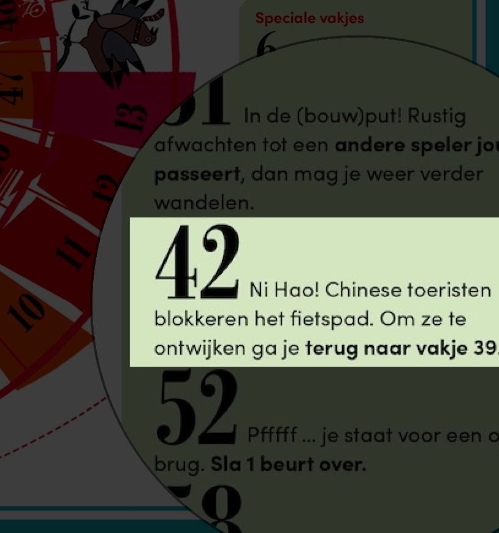

# chinezenopfietspad

> **🎲Play it live:** [English](https://chinezenopfietspad.nl/) · [Nederlands](https://chinezenopfietspad.nl/nl/) · [中文](https://chinezenopfietspad.nl/zh/)

## The story

To celebrate Amsterdam's 750th anniversary, the city published a children's book and distributed it to approximately 60,000 primary school children. Inside was a classic Dutch *ganzenbord* — the roll-and-move board game every Dutch child grows up with. One of the hazard tiles singled out Chinese tourists blocking the bike path, with the instruction (translated): *"To avoid them, go back to tile 39."*



No irony. No context. Just a throwaway line in a book handed to tens of thousands of kids. ([RTL Nieuws coverage](https://www.rtl.nl/nieuws/binnenland/artikel/5512342/amsterdam-750-jaar-jubileum-boek-chinese-toeristen))

The obvious response — a formal complaint, an open letter, a thread about racism — would have confirmed exactly what the tile implied: that Chinese people can't take a joke. In Western cultural contexts, that kind of reaction invites more mockery, not less.

So this project takes a different approach. **Return the joke in the same envelope it arrived in.**

*Chinezenopfietspad* is a playable ganzenbord — 63 tiles, dice, hazards and all — where every themed tile is an observation about Dutch daily life. Geography, material conditions, food, people. Tile 39 is reserved for the counter-punch to the book.

The tone is observational and absurdist, never bitter. If a reader's reaction is "Chinese people are too serious to take a joke," the strategy has failed.

---

## 这个项目的由来

阿姆斯特丹市政府出版了一本庆祝建城750周年的儿童书，发放给全市约六万名小学生。书里有一个荷兰传统游戏"赛鹅图"（ganzenbord），其中一个惩罚格专门提到中国游客堵住自行车道，处罚是（大意）：*"为了给他们让路，退回第39格。"*

没有语境，没有反讽，就这么一句话印在发给几万个孩子的书里。

面对这种事，惯常的反应是——严正抗议、写公开信、发帖讨论种族歧视。但在西方文化语境下，这类反应往往适得其反：坐实"中国人开不起玩笑"的刻板印象，反而招来更多嘲笑。

所以这个项目选了另一条路：**用魔法打败魔法，把玩笑开回去。**

*Chinezenopfietspad*（占自行车道的中国人）是一个可以玩的赛鹅图——63格、骰子、各种惩罚格——每个主题格都是对荷兰日常生活的观察：地理、物质条件、饮食、人。第39格留给那个回击。

基调是观察式的、荒诞的，不苦大仇深。如果读者的反应是"中国人太认真，开不起玩笑"——那这个策略就失败了。

## How to add a tile

Every tile lives in `src/data/tiles/v1_en.yaml` (English), `src/data/tiles/v1_nl.yaml` (Dutch), and `src/data/tiles/v1_zh.yaml` (Chinese) — one YAML file per language, keyed by tile number `"1"` through `"63"`. To fill in a new tile:

1. Open `src/data/tiles/v1_en.yaml` (and the `v1_nl.yaml` / `v1_zh.yaml` siblings).
2. Find the entry for the tile number you want, e.g. `"7":`.
3. Change `status: empty` to `status: filled` and add the fields:

   ```yaml
   "7":
     status: filled
     title: Hot water is not a thing
     body: |
       If you like to have some hot water in a restaurant, you will have to
       order a cup of tea…
     icon: fa fa-mug-hot      # optional FontAwesome class
   ```

4. Save. The dev server hot-reloads; refresh to see the tile on the board.

Tile `"39"` is **reserved** — that's the counter-punch to the Amsterdam 750 book. Don't use it for a casual tile.

Hazard tiles (geese, well, maze, etc.) are already pre-seeded — leave them alone unless you want to rewrite the Dutch flavor text.

## Local development

```sh
npm install

# Dev server with hot reload
npm run dev

# Production build (outputs to ./dist)
npm run build

# Preview production build
npm run preview
```

## Deploy

Pushes to `main` trigger an automatic Cloudflare Pages build (`npm run build`, `dist/` published) — live at <https://chinezenopfietspad.nl>. PR/branch pushes get their own preview URLs.

## Stack

- **Astro** — static site generator (`output: 'static'`)
- **Svelte 5** — interactive game island (`client:load`)
- **SCSS** — styles
- **Cloudflare Pages** — hosting
- **PostHog** (EU) — analytics

## License

Dual-licensed: **code** under Apache 2.0, **content** under Creative Commons Attribution-ShareAlike 4.0 International (CC BY-SA 4.0). See [`LICENSE`](./LICENSE) for the split, [`LICENSE-CODE`](./LICENSE-CODE) for the Apache text, and [`LICENSE-CONTENT`](./LICENSE-CONTENT) for the CC text.

If you repost or remix the tile content, credit "Chinezen op Fietspad" and link back. Derivative content stays under CC BY-SA 4.0.
